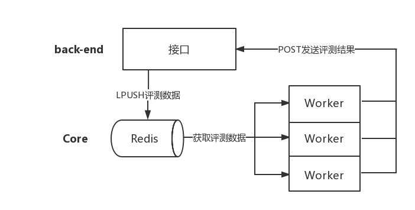

# [Gohan Online Judge](http://120.77.241.49/web)

## 介绍

#### `Gohan OJ`基本架构图


`Gohan OJ`是基于C与PHP编写的在线评测系统，目前仅支持C/C++语言。

`Gohan OJ`系统分为2个部分，web端和评测核心。
评测核心由C语言编写，以守护进程的方式运行，采用多线程评测的方式，每个线程通过轮询Redis的List得到评测数据，然后经过编译用户代码、运行程序、比较结果数据这三个步骤得到最终评测结果，然后使用HTTP协议POST发送评测结果到指定的更新接口。其中多线程通过使用互斥锁来保证数据的一致性。

web部分采用前后端分离的方案，方便前后端重用，前端主要用Jquery+Bootstrap编写，后端主要用PHP的CodeIgniter框架编写。[后端接口文档地址](http://apizza.cc/console/project/ec1bea88fbfae96b7449026c2bc85b9a/browse)

## 评测核心的安装与运行

首先保证你的Linux系统安装了lnmp与Redis与git。
```shell
git clone https://github.com/dontbesad/GohanOnlineJudge
cd GohanOnlineJudge

./Hiredis.sh #如果你没有安装hiredis模块
./Init.sh    #如果你是第一次运行

./Gohan.sh   #启动评测机
```
后续会更新...

## 配置文件说明 core/gohan.conf
```
#服务器用户,通常apache对应www-data,nginx对应nginx,如果你的服务器是nginx,请设置成nginx
SERVER_USER=www-data

#OJ工作目录
OJ_WORKDIR=/home/judge

#上传文件的目录, 最终的数据文件: /home/judge/data/题目号/data.in(out)
OJ_DATADIR=/home/judge/data

#OJ核心编译后的各部分可执行文件
OJ_COMPILER=/home/judge/compiler
OJ_JUDGER=/home/judge/judger
OJ_COMPARER=/home/judge/comparer
OJ_PROGRAM=/home/judge/Gohan

# mysql配置,核心现已改成redis版本,所以此配置暂时废弃!
OJ_DB_HOST=127.0.0.1
OJ_DB_PORT=3306
OJ_DB_USER=root
OJ_DB_PASS=yangye
OJ_DB_NAME=oj

#redis配置
OJ_REDIS_HOST=127.0.0.1
OJ_REDIS_PORT=6379
OJ_REDIS_QUEUE=solution #list队列的名字

#核心评测的结果数据通过HTTP请求发送至此接口去处理
OJ_API_URL=http://localhost/api/index.php/judge/update_result

#OJ开启的评测线程数量,默认3个,建议设置成你服务器相同的CPU核数
OJ_THREAD=3
```
